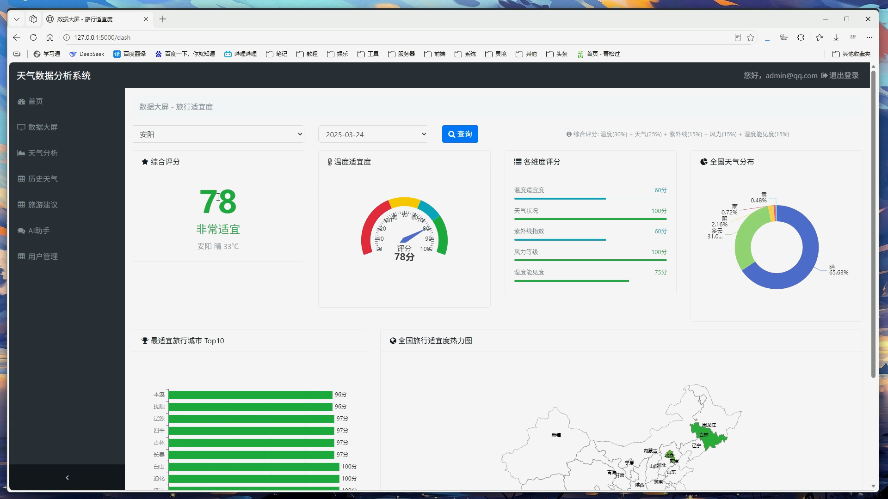
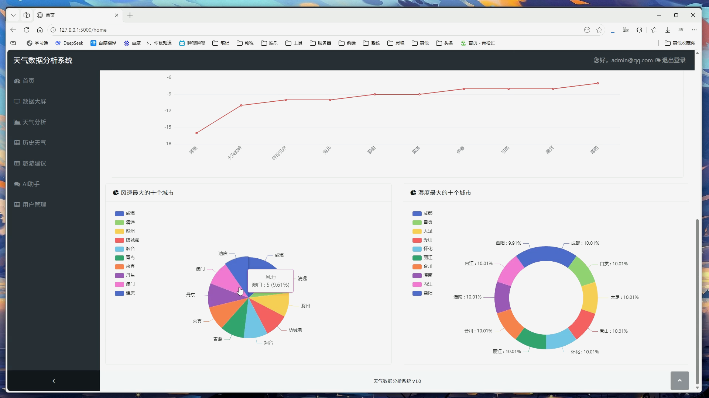
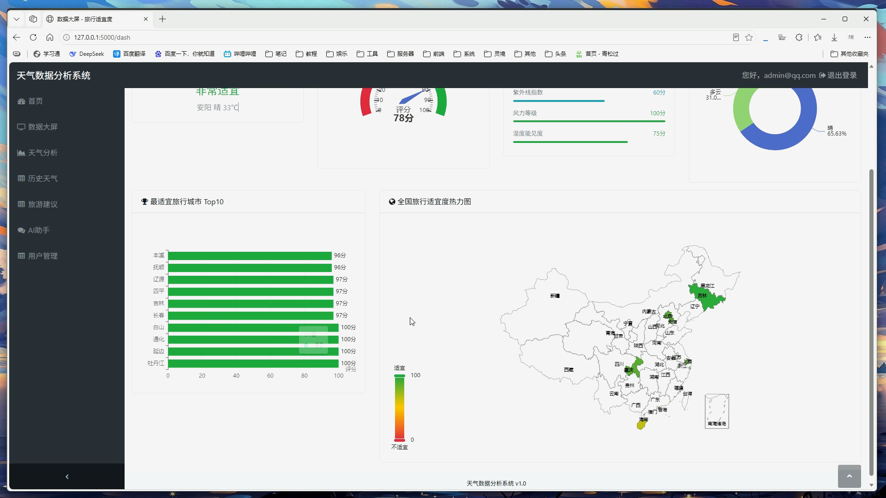
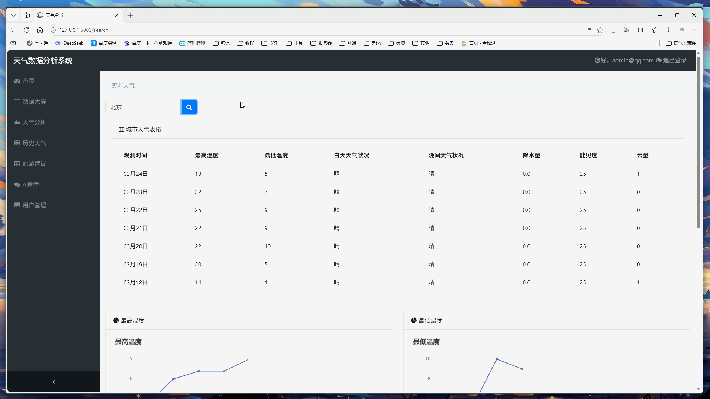
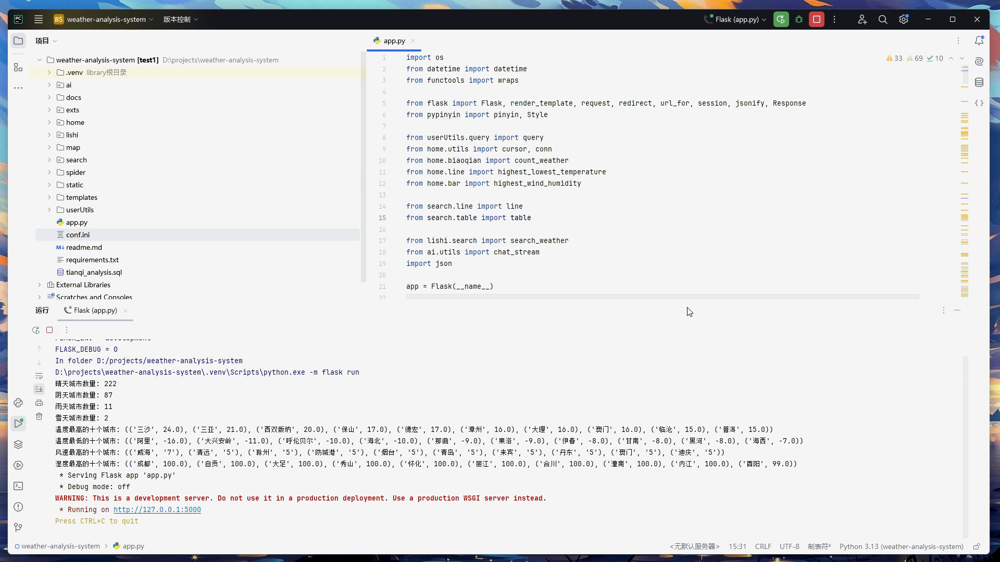
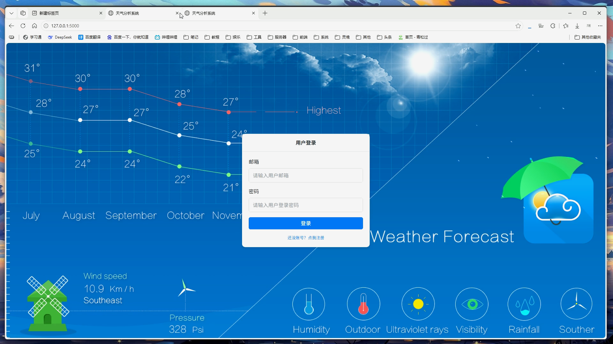
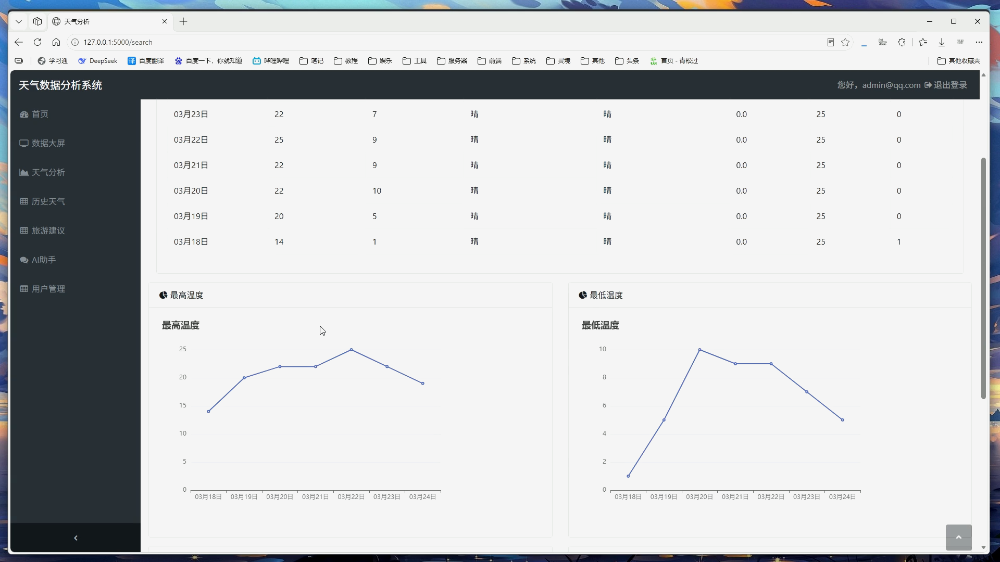
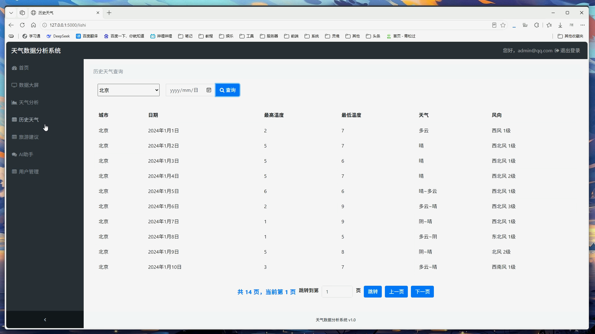
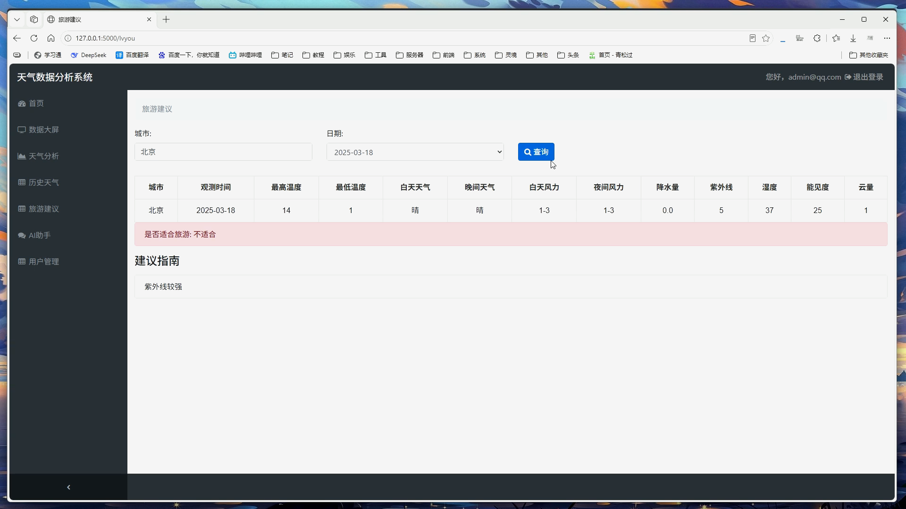

## 计算机毕业设计Python+AI大模型天气助手 天气可视化 天气预测系统 大数据毕业设计(源码+LW+PPT+讲解)

## 要求
### 源码有偿！一套(论文 PPT 源码+sql脚本+教程)

### 
### 加好友前帮忙start一下，并备注github有偿天气26
### 我的QQ号是2827724252或者微信:bysj2023nb

# 

### 加qq好友说明（被部分 网友整得心力交瘁）：
    1.加好友务必按照格式备注
    2.避免浪费各自的时间！
    3.当“客服”不容易，repo 主是体面人，不爆粗，性格好，文明人。

## 演示视频如下：

https://www.bilibili.com/video/BV1pDGv6uEsh/

## 演示视频

https://www.bilibili.com/video/BV1pDGv6uEsh/

